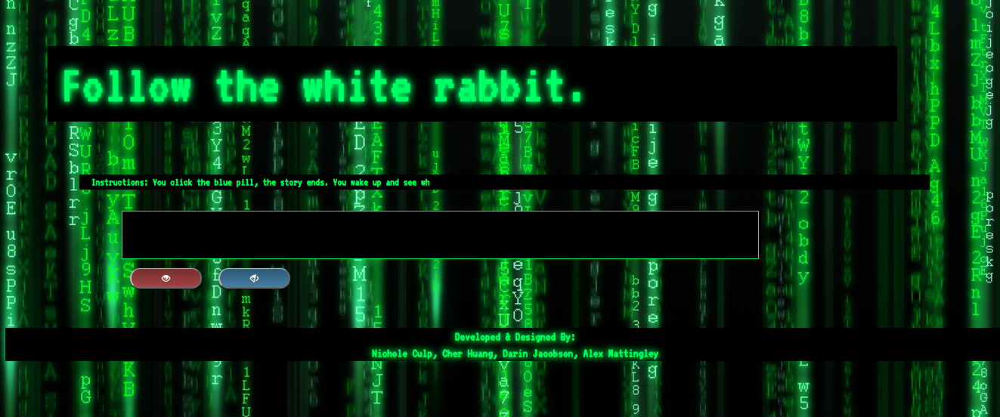
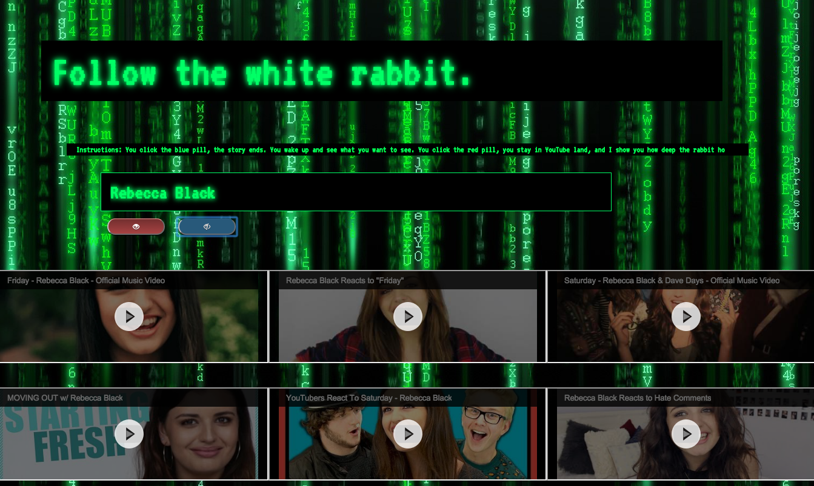
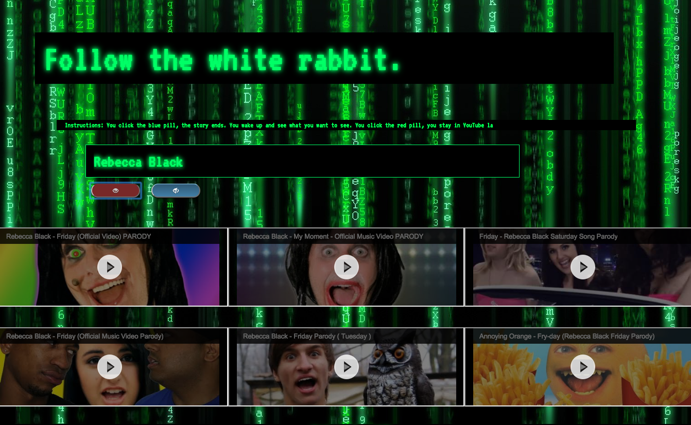

<h1>Hackathon 1</h1>
<h4>Parody-Project</h4>

<h3>Our challenge:</h3> 
  - To learn how to use one of 5 APIs (our team picked YouTube).   
  - Must present information to the user based upon dynamic interaction
  
<h3>My role in this project:</h3>
  - I was team lead, so I was in charge of making sure we worked as a team, got our work done, doing stand-ups, ensuring our code was merged correctly and in a timely manner at the end of the hackathon
  - Me and one other team member had the roles of learning about APIs, and how to use the one we picked, YouTube.  We studied together, and then once we learned how to use the YouTube API, we conveyed that information to our team so they knew the information as well.  

<h3>Description:</h3>

This was the first hackathon we did as students of LearningFuze.  We were still extremely new to programming, and knew nothing about APIs.

We decided to make our project a Matrix mashup, making YouTube, which we all know is a rabbit hole in itself (just keep on clicking on new videos eventually watching ones that aren't even close to what you started out watching), and make the rabbit hole even deeper by adding a comedic effect.

<h3>Time alotted to complete:</h3>
  - 10 hours, 8 on Wednesday, 2 on Thursday.  
  
<h3>Feature List</h3>
  - Input section.  The user will input a name of a video they want to look up.  However, to submit, they have one of two choices.  They can pick either the red pill or the blue pill.  
  -   If you click the blue pill, "the story ends. You wake up and see what you want to see."  This will show you videos pulled from YouTube of exactly what you wanted to see.  For example, if you typed "No Doubt," it would bring up a series of No Doubt videos.  
  

  -   If you click the red pill, "you stay in YouTube land, and I show you how deep the rabbit hole goes."  This will bring up videos of paradies and spoofs of whatever you typed in.  For example, if you typed in "Rebecca Black," it would bring up a series of Rebecca Black spoof/parody videos, making the "rabbit hole" that YouTube already is, and make it even deeper and more disturbing.  

<h3>Things I learned during this Hackathon:</h3>
  - Working in a team.  This included work delegation, stand-ups, making sure we're all on the same page for the project, etc
  - How to research and use API calls.  
  - Manual merging of code from each teammates' work into the test branches, and after testing, merging into our master branch using Git & GitHub
